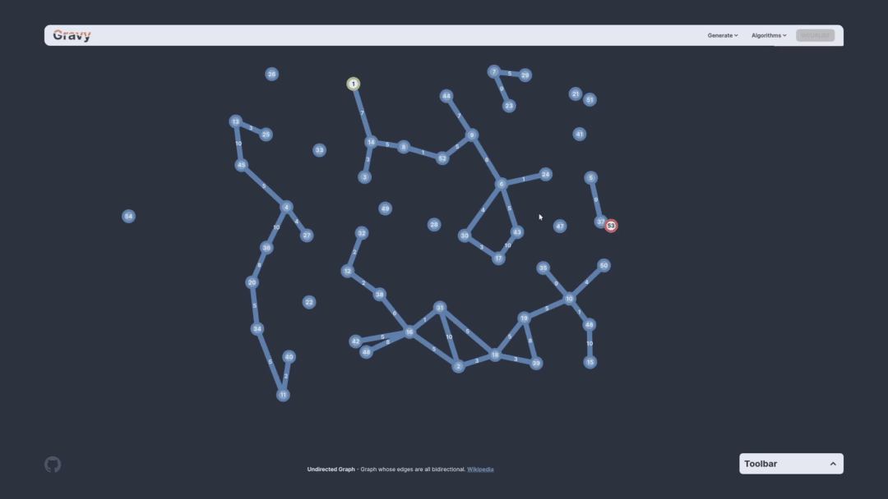

# Gravy - Graph Visualisation
__Gravy is now live! (<https://gravy.thud.dev>)__



Gravy is a toy for generating graphs and visualising various algorithms on them. It allows you to create a graph by placing nodes and connections, provides support for connection weights/directions as well as the choice of a few commonly used graphs which are generated in realtime.  
Upon reaching Gravy, you will receive a walkthrough on how to use it.

## Get Started
1. Gravy is live now at __<https://gravy.thud.dev>__. If you just want to play around with some graphs go there.

2. To run locally, clone this repo and then run the following :point_down::

```
$ npm i
$ npm run dev
```


:smirk: Made by JP
